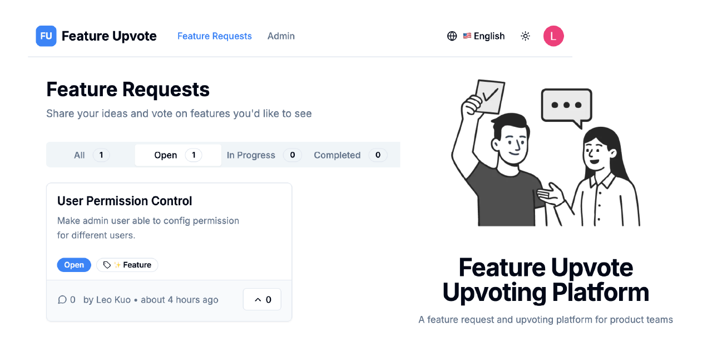

# Feature Upvote Platform

[English](#english) | [中文](#中文)




## 🚀 Live Demo

**Try it now:** https://feature-upvote.vercel.app/

_Experience the full platform with real-time voting, comments, and admin features_

---

## English

A modern feature request and voting platform built with **Firebase + Vercel** for effortless deployment. Get your feedback platform live in minutes, not hours.

### 🎯 Target Users

**Product Managers** and **Developers** who want to quickly deploy a feature voting platform for their products

### ⚡ Quick Deploy

**Why Firebase + Vercel?**

- 🔥 **Firebase**: Zero backend setup - authentication, database, and hosting ready out-of-the-box
- ⚡ **Vercel**: One-click deployment with automatic CI/CD
- 🧠 **No-Brain Setup**: Copy, paste, deploy - that's it!

```bash
# 1. Clone project
git clone <repository-url>
cd feature-upvote

# 2. Install dependencies
pnpm install

# 3. Setup Firebase (5 minutes)
# See: docs/FIREBASE_SETUP.md

# 4. Deploy to Vercel (2 minutes)
# See: docs/DEPLOYMENT.md
```

**⏱️ Total time: ~10 minutes from zero to production**

### ✨ Core Features

#### 🔐 User System

- **Google OAuth Login** - No additional registration process
- **Admin Permissions** - Complete content management capabilities
- **Guest Friendly** - Browse content, participate after login

#### 📝 Feature Request Management

- **Complete Lifecycle** - Status tracking from submission to completion
- **Voting Mechanism** - Understand user priority needs
- **Label System** - Flexible categorization management
- **Comment Discussion** - Deep user feedback collection

#### 🎨 Brand Customization

- **Project Name** - Custom platform title
- **Tagline Settings** - Personalized description
- **Theme Colors** - Match brand visuals
- **Live Preview** - What you see is what you get

#### 📊 Data Insights

- **Vote Statistics** - Understand feature demand heat
- **User Activity** - Track community engagement
- **Comment Analysis** - Deep understanding of user needs

### 🛠 Tech Stack

#### Why This Stack?

- **🚀 Zero Configuration**: Firebase handles all backend complexity
- **⚡ Instant Deployment**: Vercel's edge network for global performance
- **💰 Cost Effective**: Both platforms offer generous free tiers
- **🔧 Developer Friendly**: Focus on features, not infrastructure

#### Frontend

- **Next.js 14** - App Router + Server Components
- **TypeScript** - Complete type safety
- **Tailwind CSS** - Modern styling system
- **shadcn/ui** - High-quality UI components
- **TanStack Query** - Efficient data management

#### Backend Services (Firebase)

- **Firebase Auth** - Secure user authentication (Google OAuth ready)
- **Firestore** - Real-time NoSQL database
- **Security Rules** - Fine-grained permission control
- **Analytics** - Built-in user behavior tracking

#### Deployment (Vercel)

- **Edge Functions** - Server-side rendering at the edge
- **Automatic CI/CD** - Deploy on every Git push
- **Global CDN** - Lightning-fast worldwide access
- **Zero Config** - Works perfectly with Next.js out of the box

### 🚀 Deployment Options

| Platform         | Difficulty | Time   | Recommendation |
| ---------------- | ---------- | ------ | -------------- |
| **Vercel**       | ⭐         | 2 min  | ⭐⭐⭐⭐⭐     |
| Netlify          | ⭐⭐       | 5 min  | ⭐⭐⭐⭐       |
| Firebase Hosting | ⭐⭐⭐     | 10 min | ⭐⭐⭐         |

### 📁 Project Structure

```
src/
├── app/                    # Next.js page routing
├── entities/              # Business entities (users, feature requests, comments)
├── features/              # Feature modules
├── widgets/               # Composite components
├── shared/                # Shared resources
│   ├── ui/                # UI component library
│   ├── hooks/             # Shared hooks
│   ├── lib/               # Utility functions
│   └── config/            # Configuration files
└── lib/                   # Application configuration
```

### 🔧 Development Commands

```bash
pnpm dev          # Development mode
pnpm build        # Production build
pnpm start        # Production server
pnpm lint         # Code linting
pnpm type-check   # Type checking
```

### 📖 Documentation Guide

| Document                                 | Purpose                       | Estimated Time |
| ---------------------------------------- | ----------------------------- | -------------- |
| [Firebase Setup](docs/FIREBASE_SETUP.md) | Backend service configuration | 5 min          |
| [Deployment Guide](docs/DEPLOYMENT.md)   | Production deployment         | 2 min          |
| [Admin Guide](docs/ADMIN.md)             | Platform customization        | 3 min          |

### 🎨 Customization Highlights

- **🎯 Zero-Code Branding** - Complete through admin panel, no code changes needed
- **🌈 Live Theme Preview** - Changes take effect immediately
- **📱 Responsive Design** - Perfect adaptation to all devices
- **🌍 Multi-language Support** - Built-in Chinese/English switching
- **🔥 Firebase Magic** - Real-time updates across all users instantly
- **⚡ Vercel Power** - Global edge deployment for lightning speed

### 🤝 Contributing

1. Fork the project
2. Create a feature branch (`git checkout -b feature/amazing-feature`)
3. Commit your changes (`git commit -m 'Add amazing feature'`)
4. Push to the branch (`git push origin feature/amazing-feature`)
5. Open a Pull Request

### 📝 License

MIT License - See [LICENSE](LICENSE) for details

---

## 中文

基於 **Firebase + Vercel** 打造的現代化功能請求投票平台，讓你輕鬆部署。幾分鐘內就能讓你的反饋平台上線，不用幾小時。

### 🎯 目標使用者

**產品經理** 和 **開發者** 希望快速為自己的產品部署一個功能投票平台

### ⚡ 快速部署

**為什麼選擇 Firebase + Vercel？**

- 🔥 **Firebase**：零後端設置 - 認證、資料庫、託管開箱即用
- ⚡ **Vercel**：一鍵部署，自動 CI/CD
- 🧠 **快速設置**：複製、貼上、部署 - 就這麼簡單！

```bash
# 1. 複製專案
git clone <repository-url>
cd feature-upvote

# 2. 安裝依賴
pnpm install

# 3. 設置 Firebase（5分鐘）
# 參考：docs/FIREBASE_SETUP.md

# 4. 部署到 Vercel（2分鐘）
# 參考：docs/DEPLOYMENT.md
```

**⏱️ 總時間：從零到正式環境約 10 分鐘**

### ✨ 核心功能

#### 🔐 用戶系統

- **Google OAuth 登入** - 無需額外註冊流程
- **管理員權限** - 完整的內容管理能力
- **訪客友好** - 可瀏覽內容，登入後參與互動

#### 📝 功能請求管理

- **完整生命週期** - 從提交到完成的狀態追蹤
- **投票機制** - 了解用戶需求優先級
- **標籤系統** - 靈活的分類管理
- **評論討論** - 深度用戶反饋收集

#### 🎨 品牌自訂

- **專案名稱** - 自訂平台標題
- **標語設定** - 個性化描述
- **主題色彩** - 符合品牌視覺
- **即時預覽** - 所見即所得

#### 📊 數據洞察

- **投票統計** - 了解功能需求熱度
- **用戶活躍度** - 掌握社群參與情況
- **評論分析** - 深入理解用戶需求

### 🛠 技術架構

#### 為什麼選擇這個技術棧？

- **🚀 零配置**：Firebase 處理所有後端複雜性
- **⚡ 即時部署**：Vercel 邊緣網路提供全球性能
- **💰 成本效益**：兩個平台都提供慷慨的免費額度
- **🔧 開發者友好**：專注於功能，而非基礎設施

#### 前端技術

- **Next.js 14** - App Router + Server Components
- **TypeScript** - 完整類型安全
- **Tailwind CSS** - 現代化樣式系統
- **shadcn/ui** - 高質量 UI 組件
- **TanStack Query** - 高效數據管理

#### 後端服務 (Firebase)

- **Firebase Auth** - 安全的用戶認證（Google OAuth 開箱即用）
- **Firestore** - 實時 NoSQL 資料庫
- **Security Rules** - 細粒度權限控制
- **Analytics** - 內建用戶行為追蹤

#### 部署平台 (Vercel)

- **Edge Functions** - 邊緣伺服器端渲染
- **自動 CI/CD** - 每次 Git 推送自動部署
- **全球 CDN** - 全球閃電般快速訪問
- **零配置** - 與 Next.js 完美搭配開箱即用

### 🚀 部署選項

| 平台             | 難度   | 時間    | 推薦度     |
| ---------------- | ------ | ------- | ---------- |
| **Vercel**       | ⭐     | 2 分鐘  | ⭐⭐⭐⭐⭐ |
| Netlify          | ⭐⭐   | 5 分鐘  | ⭐⭐⭐⭐   |
| Firebase Hosting | ⭐⭐⭐ | 10 分鐘 | ⭐⭐⭐     |

### 📁 專案結構

```
src/
├── app/                    # Next.js 頁面路由
├── entities/              # 業務實體（用戶、功能請求、評論）
├── features/              # 功能模組
├── widgets/               # 複合組件
├── shared/                # 共享資源
│   ├── ui/                # UI 組件庫
│   ├── hooks/             # 共用 Hooks
│   ├── lib/               # 工具函數
│   └── config/            # 配置文件
└── lib/                   # 應用配置
```

### 🔧 開發指令

```bash
pnpm dev          # 開發模式
pnpm build        # 生產構建
pnpm start        # 生產服務器
pnpm lint         # 代碼檢查
pnpm type-check   # 類型檢查
```

### 📖 文檔指南

| 文檔                                    | 用途         | 預估時間 |
| --------------------------------------- | ------------ | -------- |
| [Firebase 設置](docs/FIREBASE_SETUP.md) | 後端服務配置 | 5 分鐘   |
| [部署指南](docs/DEPLOYMENT.md)          | 上線部署     | 2 分鐘   |
| [管理員指南](docs/ADMIN.md)             | 平台自訂設置 | 3 分鐘   |

### 🎨 自訂功能亮點

- **🎯 零代碼品牌化** - 通過管理面板即可完成，無需修改代碼
- **🌈 實時主題預覽** - 修改即時生效
- **📱 響應式設計** - 完美適配各種設備
- **🌍 多語言支援** - 內建中英文切換
- **🔥 Firebase 魔法** - 所有用戶即時同步更新
- **⚡ Vercel 威力** - 全球邊緣部署閃電般速度

### 🤝 貢獻指南

1. Fork 專案
2. 創建功能分支 (`git checkout -b feature/amazing-feature`)
3. 提交更改 (`git commit -m 'Add amazing feature'`)
4. 推送分支 (`git push origin feature/amazing-feature`)
5. 開啟 Pull Request

### 📝 授權

MIT License - 查看 [LICENSE](LICENSE) 了解詳情

---

**Feature Upvote** - Making feature request management simple and efficient 🚀
